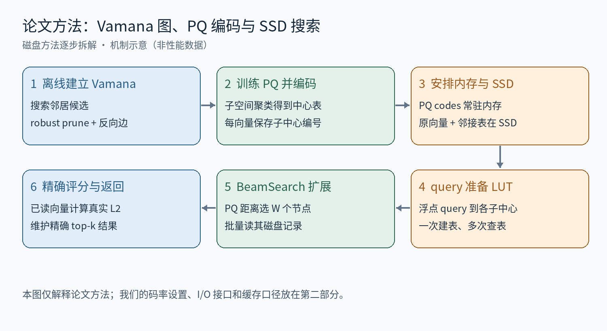
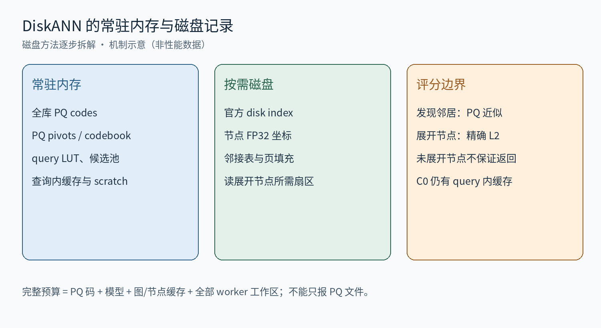

# DiskANN-PQ 磁盘版逐步拆解：内存 PQ 导航与磁盘精确评分

第一部分按 SAQ 解读的顺序介绍论文原方法：全流程与符号 → 分步训练/编码 → 索引存储与查询 → 误差与边界。第二部分简述我们的磁盘实验改动和实际执行顺序。2026-09-15 调整结构；实验实现以此前核对的代码快照为依据，本次不运行新实验。

## 第一部分：论文中的 DiskANN 方法

### 一、先看全流程与符号

DiskANN 的主线是：先用 Vamana 建立可导航的稀疏图，再以 PQ 压缩数据库向量。查询时用内存中的 PQ 码估计邻居距离、选择扩展节点；访问 SSD 上该节点的原始向量与邻接表，并用精确距离维护最终结果。磁盘设计本身就是原论文的一部分。

| 符号 | 类型 / 含义 |
| --- | --- |
| N,D；x,q∈Rᴰ | 库大小、维数；数据库向量、query |
| G；R；α | 有向图；最大出度；robust pruning 松弛参数 |
| Lbuild,L,W | 建图搜索宽度；查询候选池容量；每轮扩展节点数 |
| M,K；cₘⱼ；kₘ(x) | PQ 子空间数、中心数；子中心；存储的整数编号 |
| Tₘ(j)；kout | query 到子中心的距离表；返回邻居数 |

### 二、步骤 1：Vamana 搜索候选并选择邻接边

输入是原始数据库向量与出度预算 R。论文先初始化图，再按顺序以每个数据库点 p 为 query，在当前图上运行 GreedySearch 获得候选；随后用 RobustPrune 选出至多 R 个邻居，加入反向边，对超出度数预算的邻接表再剪枝。输出是一份可供搜索的图，而不是每个点最接近的 R 个点的简单列表。

RobustPrune 每次先选距 p 最近的候选 v，再从其余候选中移除可被 v 覆盖的点 u。用欧氏距离 δ 表示时，核心覆盖条件为：

$$
\alpha\,\delta(v,u)\le\delta(p,u),\qquad\delta(a,b)=\|x_a-x_b\|_2.
$$

α=1 时更容易剪掉局部冗余边；增大 α 使条件更严格、保留更多连接机会，有助于形成长程导航。这里 α 作用在欧氏距离上；若用平方距离表达同一条件，左侧应是 α²δ²，不能混用。论文采用两遍构造，先 α=1，再用目标 α。建图距离基于全精度向量。

### 三、步骤 2：训练 PQ 码本并编码数据库

把 D 维坐标分成 M 个子空间，在各子空间上聚类得到 K 个中心。编码一个 x 时，各子空间选择最近中心，只存中心编号。PQ 压缩的是子向量，不是为每个原始坐标独立选择一个标量刻度。

$$
k_m(x)=\arg\min_{0\le j<K}\|x^{(m)}-c_{m,j}\|_2^2,\qquad \widetilde x=[c_{1,k_1(x)};\ldots;c_{M,k_M(x)}].
$$

$$
\mathrm{codebits}(x)=M\log_2K.
$$

例如 K=256、M=32 时，每个子码 1 字节，整向量编码 32 字节。这里 32 是子空间数，不是 32 bit/维。码本由全库共享，必须额外存储。PQ 码率越高通常重建误差越低，同时常驻内存与每候选查表次数增加。

### 四、步骤 3：索引真正存下什么

| 对象 | 论文中的位置 / 作用 |
| --- | --- |
| 全库 PQ codes 与码本 | 内存；为任意新邻居提供便宜的距离估计 |
| 节点原始向量与邻接 ID | SSD 中共置；扩展节点时一并读取 |
| 热门节点记录 | 可选内存缓存；减少反复访问 SSD |
| 候选池与查询 LUT | 每 query 工作区；不属于共享数据库码 |

固定宽节点记录可以通过 ID 计算偏移；度数不足时填充。原向量随邻接表共置，目的是复用扩展操作已经发生的读取来做精确评分。论文用低维数据说明一条记录可以落在一个扇区；更高维或更大 R 时，记录可能跨多个扇区。

### 五、步骤 4：浮点 query 准备 ADC 查表

$$
T_m(j)=\|q^{(m)}-c_{m,j}\|_2^2,\qquad \widehat d_{\rm PQ}^2(q,x)=\sum_m T_m(k_m(x)).
$$

输入是浮点 query 与共享码本；输出是 M 张距离表。之后每个候选只需读它的 PQ 编号并 lookup-add，无须重建完整 x。该式省略共享平移的等价记号，说明的是浮点 query 对数据库 PQ 码的非对称距离计算。

### 六、步骤 5：BeamSearch 与隐式重排

查询从入口开始，候选池按 PQ 近似距离维护最多 L 个节点。每轮选最多 W 个尚未扩展的近候选，一起请求其 SSD 记录；读回后用邻接 ID 找到新节点，以内存 PQ 码评分并更新候选池。W 控制一次推进多少节点，L 控制保留多少搜索候选，两者不同。

读取的原向量用于计算 d²(q,x)=Σⱼ(qⱼ−xⱼ)²，并维护精确结果。由于原向量与邻接表同读，不必末尾再随机取回所有候选原向量；论文称其为 implicit re-ranking。停止后从已精确评估的节点中返回 top-k。热门节点缓存还可进一步减少 I/O。

### 七、从误差看方法边界

$$
e_x=\widetilde x-x,\qquad\widehat d_{\rm PQ}^2-d^2=-2(q-x)^\top e_x+\|e_x\|^2.
$$

PQ 误差会改变扩展优先级，有限 L 和图结构又决定访问集合。精确评分能修复已读节点之间的排序，无法找回未访问的近邻。增加 W 可能减少串行等待，也可能读入更多最终无用的节点；这需要在延迟、吞吐和 recall 之间取舍。

原论文 §2、§3.1—3.5：[DiskANN: Fast Accurate Billion-point Nearest Neighbor Search on a Single Node](https://harsha-simhadri.org/pubs/DiskANN19.pdf)

## 第二部分：我们的磁盘实验改了什么

DiskANN 本来就是磁盘算法。我们的工作主要是把官方 Rust diskann-disk 接入统一实验框架，并固定输入、码率、缓存与计数口径。

| 项目 | 实验中的处理 |
| --- | --- |
| 图与编码 | 复用 canonical shared graph；官方 PQ training/export；M=ceil(D/2)，每子码 8 bit |
| I/O 与缓存 | 官方 O_DIRECT + io_uring 路径及 completion 修复；C0 无跨 query 节点缓存，仍有 query 内页缓存 |
| 实验控制 | 固定数据划分、并发数、二进制哈希；记录实际请求和读取字节 |

实际顺序：query 建 LUT → 用内存 PQ 码维护候选池 → 选择展开节点 → 官方 reader 取节点页 → 更新邻居近似分数与当前节点精确结果 → 返回。D=1024 时 PQ 码为 512 字节/向量；FP32 原向量已占一页，加邻接表会超过一页。rerank_us=0 仅是计数口径，不表示没有精确评分。

实现定位：experiments/05_disk_system_fair/native_diskann/src/main.rs；cached_reader.rs；query_cache.rs。已有 test 结果与正式验收状态保持原口径，本次不重测。
