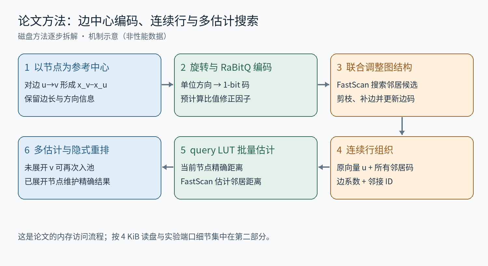
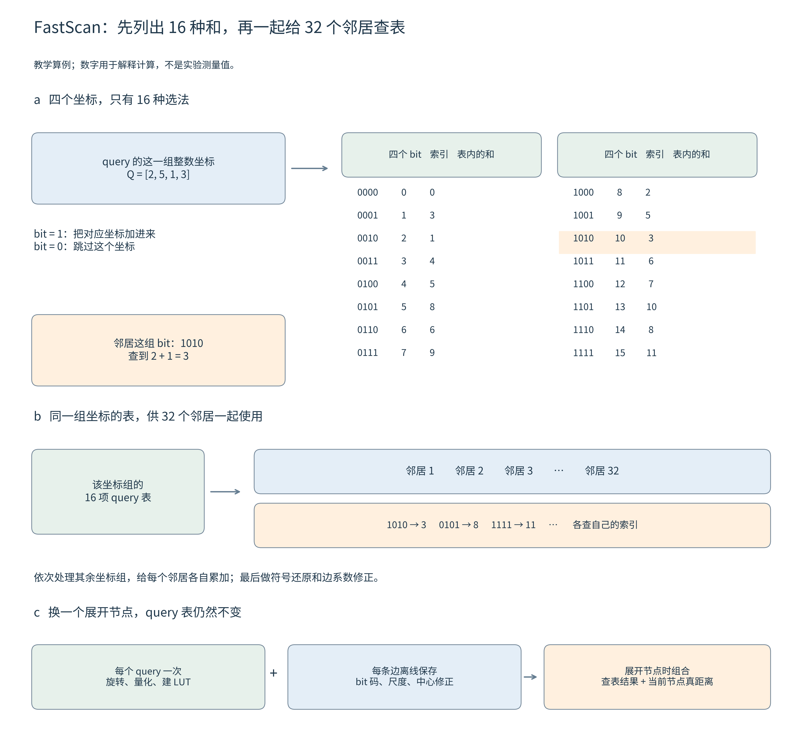
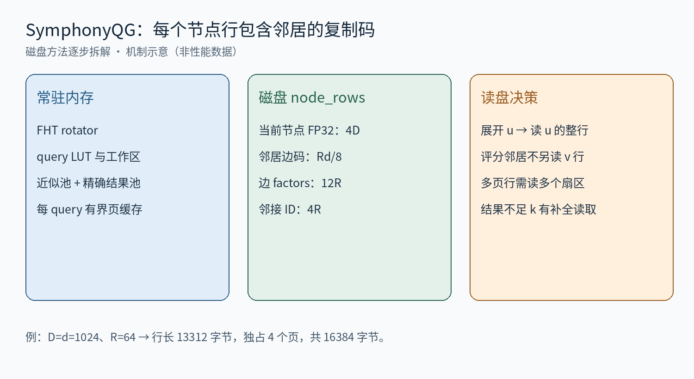

# SymphonyQG 磁盘适配逐步拆解：边局部 RaBitQ、FastScan 与隐式重排

第一部分按 SAQ 解读的顺序介绍论文原方法：全流程与符号 → 分步训练/编码 → 索引存储与查询 → 误差与边界。第二部分简述我们的磁盘实验改动和实际执行顺序。2026-09-15 调整结构；实验实现以此前核对的代码快照为依据，本次不运行新实验。

## 第一部分：论文中的 SymphonyQG 方法

### 一、先看全流程与符号

SymphonyQG 把图结构、RaBitQ 编码和 FastScan 联合设计：对每个节点，以它自己为中心量化所有邻居，并将这些边码连续保存；搜索时批量估计邻居距离，同时利用当前节点的原向量做精确评分。理解顺序是先弄清一条边怎样编码，再看这些编码如何支撑建图、存储和查询。

| 符号 | 类型 / 含义 |
| --- | --- |
| xᵤ,xᵥ,q∈Rᴰ | 当前节点、邻居向量和 query |
| T；d | 共享正交/补维旋转；编码维数 |
| zᵤᵥ=T(xᵥ−xᵤ)；nᵤᵥ | 边残差及其模长 |
| oᵤᵥ；sᵤᵥ；αᵤᵥ | 单位残差、单位符号码方向、二者内积 |
| R,L,kout | 出度、候选池容量、最终结果数 |

### 二、步骤 1：以当前节点为中心，分离边长与方向

$$
z_{uv}=T(x_v-x_u),\quad n_{uv}=\|x_v-x_u\|,\quad o_{uv}=z_{uv}/n_{uv},\quad y_u=T(q-x_u).
$$

$$
\|q-x_v\|^2=\|q-x_u\|^2+n_{uv}^2-2y_u^\top z_{uv}.
$$

输入是一条边 u→v。输出是邻居相对 u 的残差方向和真实边长。中心不是全库一个均值：同一 v 可以在不同父节点下拥有不同编码。这既是边码需要复制的原因，也是后面多次估计同一候选的基础。零长度边不使用单位化除法。

### 三、步骤 2：1-bit 方向码与比值修正

$$
s_{uv}=\operatorname{sign}(o_{uv})/\sqrt d,\quad \alpha_{uv}=o_{uv}^\top s_{uv},\quad t_{uv}=n_{uv}s_{uv}/\alpha_{uv}.
$$

$$
\widehat d_{uv}^2=\|q-x_u\|^2+n_{uv}^2-2y_u^\top t_{uv}.
$$

这是忽略 query 量化误差时的方向估计表达。实际保存符号 bit 与可预计算系数，查询不用显式构造 t。α 是方向内积；除以 α 修正尺度，不能误写成再改变码字方向。与 SAQ 示例的比值估计相似，保留真实模长后，只近似距离中的交叉内积。

$$
z_{uv}^\top(t_{uv}-z_{uv})=0.
$$

该恒等式说明理想代数中的替代向量误差垂直于原边残差，不表示任意 query 的内积都准确。与全局数据库码不同，每条出边都需要自己的方向和因子。

### 四、步骤 3：FastScan 怎样批量计算内积

FastScan 做的事可以分成三步：query 先把可能用到的坐标和算好，邻居拿自己的 bit 码查表，再让 SIMD 同时处理一批邻居。先看一个只有四个坐标的例子。

**1．先把四个坐标的 16 种选法列成表**

假设 query 已旋转并量化，这一组四个整数坐标为 Q=[2,5,1,3]。一个邻居在这四个坐标上的符号用四个 bit 表示：1 对应正号，0 对应负号。为了方便查表，先只加 bit 为 1 的坐标；负号稍后统一还原。

四个 bit 总共只有 16 种组合，所以提前算一张 16 项的小表，叫 LUT（查找表）。例如 0000 对应 0；1010 对应第 1、3 个坐标的和 2+1=3；1111 对应四个坐标的和 11。这里按左到右对应四个坐标，1010 作为二进制索引就是 10。

有了这张表，遇到 bit 为 1010 的邻居，直接取 LUT[10]=3。不同邻居虽然 bit 不同，但查的是同一张表，因为 query 没变。每个四维坐标组都有自己的表；不是一张 16 项表覆盖整个向量。

**2．同一张表，同时给 32 个邻居使用**

把 32 个邻居在同一坐标组上的四 bit 索引放在适合 SIMD 的连续布局中。SIMD 可以在多条并行通道上执行查表：邻居 1 查 1010，邻居 2 查 0101，邻居 3 查 1111……得到的分别是 3、8、11……。随后换到下一个坐标组，继续给每个邻居各自累加。32 是一个批次的邻居数，不是一次算完 32 个完整距离的单条指令。

为什么快：小表能放在 SIMD 寄存器中，多个邻居并行查表；码按批排列，避免逐邻居到分散位置取码。所有坐标组处理完，才得到每个邻居的总查表和 S。

**3．查表和还不是距离：先还原正负号，再乘边系数**

$$
\sum_j Q_j(2b_j-1)=2\underbrace{\sum_{j:b_j=1}Q_j}_{S}-\sum_jQ_j.
$$

在刚才的四维例子中，1010 表示正、负、正、负。先查得 S=3，再算 2×3−11=−5，等于直接计算 2−5+1−3。接着还要恢复 query 的量化尺度与偏移，结合该边保存的 RaBitQ 系数，才能得到邻居距离的估计值。因此 LUT 返回的 3 不是最终距离。

**4．为什么换一个展开节点，不用重新建 query 表？**

查询 q 在整次搜索中不变，因此 Tq 也不变。变化的是当前展开节点 u，以及 u 到各邻居的边码和系数。把理论式拆开就能看清两者的分工：

$$
(Tq-Tx_u)^\top t_{uv}=(Tq)^\top t_{uv}-(Tx_u)^\top t_{uv}.
$$

第一项需要 query，由同一套 query LUT 配合不同边码计算；第二项只包含数据库节点和边的信息，可以在建索引时算好并存进边系数。于是每个 query 只需旋转、量化和建表一次。展开 u 时，再计算 q 到 u 的精确距离，与查表结果、边系数组合，得到各邻居的距离估计。

记住这四个时机即可：建索引时保存边码和系数；query 开始时建 LUT；展开节点时批量查表；累加和修正后得到邻居距离。

### 五、步骤 4：用量化搜索建图，并补齐批次

论文先随机初始化图，再迭代：依据当前边生成编码，用上述搜索方法为每个节点发现候选，以 NSG 式几何规则剪枝，统一更新图。每轮内部不同节点的候选生成和剪枝可并行，轮末再切换到新图。最终邻接关系改变后重新生成匹配的边码。

若节点度数小于目标 R，FastScan 的固定批次会出现无效槽。论文对已剪候选放宽角度阈值，补足邻居，使出度对齐 32 的倍数；极端不足时还有随机补边。它减少批内浪费，但新增边及其复制码仍然占用存储空间。

### 六、步骤 5：索引真正存下什么

| 每节点对象 | 作用 / 大致成本 |
| --- | --- |
| 当前节点原向量 | 精确评分；约 4D 字节 |
| R 个邻居的边局部符号码 | 连续 FastScan 扫描；约 Rd/8 字节 |
| 逐边预计算因子 | 边长、比值修正和中心相关项 |
| 邻接 ID | 确定每个估计对应哪个节点；约 4R 字节 |

原论文将这些数据紧邻放在内存中的一个连续对象里。访问节点 u 时，一次顺序读取既支持对 u 精确评分，也支持估计所有邻居；不能把“每边每维 1 bit”解释为全库每向量只占 d/8 字节。码的复制程度与 R 有关。

### 七、步骤 6：多次估计与隐式重排

query 完成共享准备后，从候选池弹出近似距离最小的未展开节点 u，标记已访问；用它的原向量计算精确距离并更新结果，再用 u 的连续边码批量评估邻居。尚未展开的 v 可以从不同父节点多次带着不同估计入池。只有已展开者被跳过，不能在首次发现时就永久去重。

多个估计给近邻更多被优先展开的机会。论文用 RaBitQ 的统计误差性质解释这种机制；不同边的估计不应无条件当成相互独立。搜索结束时，从已经精确评分的节点返回结果，因此无需另做一轮普通的末尾原向量随机重排。

### 八、从误差看方法边界

$$
\widehat d_{uv}^2-d^2(q,x_v)=-2y_u^\top(t_{uv}-z_{uv}).
$$

上式仅分析理想 query 下单次边估计；实际 query/LUT 量化还会增加计算误差。多估计和精确结果维护减少了部分排序错误，但没有排除有限池、图路径和未展开近邻造成的遗漏。连续内存访问的收益也不自动等于磁盘场景的收益。

原论文：用户提供 SymphonyQG.pdf，§3.1—3.3、Algorithms 1—2；出版占位信息不作正式书目信息。

## 第二部分：我们的磁盘实验改了什么

将官方 QG 的连续节点行按 4 KiB 分页保存，保留 rotator、query LUT、FastScan、展开时去重及精确结果池；读取改为 O_DIRECT/libaio，加上每 query 的有界页缓存。

实际顺序：准备 query → 弹出 u → 读 u 的整行 → 精确评估 u、批量估计其邻居 → 未展开邻居入池 → 输出精确结果。未决定展开的 v 不预读整行；若结果不足 k，则按官方补全规则读取邻居。当前使用 R=64、6-bit query；unsigned 扩展修复避免 FastScan 的大累加值被解释为负数。

当前行长为 4D+Rd/8+12R+4R 字节。D=d=1024、R=64 时为 13312 字节，独占 4 页，共 16384 字节。这里新增的是页对齐及真实磁盘读取成本，不能用“一次节点访问”代替“一次 4 KiB I/O”。

实现定位：experiments/05_disk_system_fair/native/symphonyqg_disk_port.cpp；baselines/symphonyqg/symqglib/qg/qg_query.hpp、qg_scanner.hpp。
