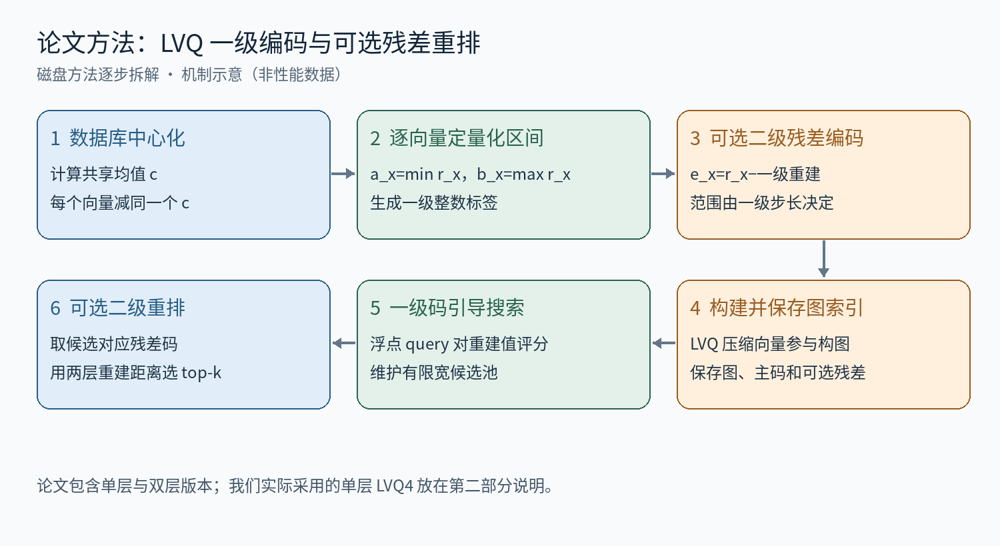
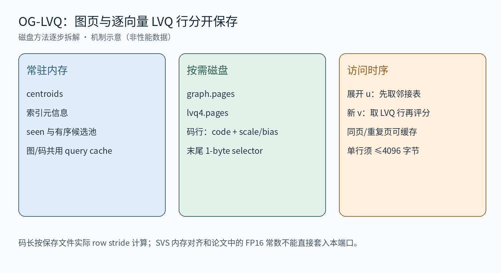

# OG-LVQ 磁盘适配逐步拆解：逐向量标量量化、Vamana 与按页取码

**先记住一句话：OG-LVQ 把向量压缩后放在内存里，沿着图找邻居，用压缩后的向量计算距离。我们的磁盘版又把图和压缩向量搬到了 SSD，读取方式因此发生了变化。**

本文仍分两部分：先按“全流程 → 编码 → 建图与查询 → 误差”的顺序解释原论文，再简述我们的磁盘改动。例子中的小向量只用于说明计算，不是实验数据。更新于 2026-09-17。

## 第一部分：论文中的 OG-LVQ 怎么做

### 一、先看全流程：谁负责找路，谁负责算距离

一条数据用一串数字表示，这串数字就是“向量”；用户这次要找的内容也表示成一个向量，叫“查询向量”。目标是找到离查询向量最近的若干条数据。

| 名称 | 在这里负责什么 |
| --- | --- |
| 图 | 每条数据记住一小份邻居名单。搜索顺着这些连接走，避免把全库都算一遍。 |
| LVQ | 把向量中的小数变成短整数编号，减少存储和读取的数据量。 |
| OG-LVQ | 论文把优化后的图搜索与 LVQ 放在一起得到的完整方法。 |
| 候选池 | 这次查询暂时保留的一份近邻名单。里面的点未必都已经查看过邻居。 |

一次查询的大致过程是：**从入口出发 → 计算邻居离查询有多远 → 保留较近的候选 → 继续查看候选的邻居 → 返回结果。**LVQ 决定这些距离怎样计算。

读下图时按编号 1 到 6 看：前四步是查询前的准备，后两步是查询时的工作。“残差”是压缩后丢掉的那一点数值差，第三节会用数字解释。

### 二、步骤 1：先把所有向量减去同一个均值

先计算整个数据库的平均向量，再让每条数据都减去它。比如平均向量是 [10, 100]，一条数据是 [11, 102]，减完就得到 [1, 2]。查询向量也用同一个均值处理。

这样做相当于一起移动坐标原点。两点都减去同一个数，它们的差不变，所以这一步不会改变真实距离。它的作用是减少各维本身的固定偏移，方便后面压缩。

### 三、步骤 2：每个向量用自己的刻度，把小数变成编号

以下用 **LVQ4** 举例：每个坐标用 4 bit，能保存 0～15 共 16 个编号。对一条已经减过均值的向量，先找出它自己最小、最大的坐标，再在这个范围内放 16 个等距刻度。

例如向量是 [−1, 0.34, 1.12, 2]。最小值是 −1，最大值是 2，所以刻度间隔为 (2 − (−1)) ÷ 15 = 0.2。每个坐标保存最近刻度的编号：

| 原来的坐标值 | 保存的编号 | 根据编号恢复的近似值 |
| --- | --- | --- |
| −1 | 0 | −1 + 0 × 0.2 = −1 |
| 0.34 | 7 | −1 + 7 × 0.2 = 0.4 |
| 1.12 | 11 | −1 + 11 × 0.2 = 1.2 |
| 2 | 15 | −1 + 15 × 0.2 = 2 |

因此，这条向量保存的是 [0, 7, 11, 15]，再加上恢复数值所需的起点和间隔。四个坐标的编号只占 2 字节；范围参数也要占空间，不能只算编号。实际高维向量更容易摊薄这部分额外开销。

**“局部自适应”指每个向量都有自己的刻度。**另一条向量如果只落在 [−0.1, 0.2]，它的间隔就是 0.02。同样编号 7，在两条向量中表示的数值可以不同。因此 LVQ 不能把不同向量的编号直接相减来算距离。

### 四、步骤 3：可选地再存一点误差，让最后排序更准

刚才 0.34 被恢复成 0.4，二者差值是 −0.06。这个“原值 − 恢复值”就叫残差。论文可以用第二层短码再压缩这点残差。

搜索大部分节点时，只使用第一层码；最后只对留下来的候选读取第二层码，把恢复值修正得更接近原值，再排一次序。例如把第一层恢复值 0.4，加上第二层给出的近似残差，就会更接近 0.34。

名称 **LVQ-4×8** 表示每坐标第一层 4 bit、第二层 8 bit。第二层需要额外存储，也需要额外计算。论文包含不同位宽的单层和双层配置；我们的磁盘实验只用了单层 LVQ4。

### 五、步骤 4：用压缩向量建立图

图可以理解为“每条数据的一份邻居名单”。论文采用 Vamana 式建图：为一个点寻找一批邻居候选，删掉部分作用重复的连接，并限制每个点保留的边数。对全库重复这个过程，得到可以搜索的图。

这些建图步骤也需要大量距离计算。论文分析了量化误差对构图的影响，并通过实验研究使用 LVQ 压缩向量构图的可行性，从而减少建图期间向量占用的内存。这里的图仍然负责导航，LVQ 负责提供计算距离的紧凑表示。

### 六、步骤 5：查询时保存什么、怎样算一个距离

原论文针对内存检索。主要保存：邻居名单、入口、每条向量的第一层码及其刻度、全库均值；双层版本还保存残差码。查询时另外开一份候选池。

**查询向量保持浮点数；数据库向量按需要从短码恢复数值。**距离计算可以一边恢复一边累加，不用提前解压整个数据库。

沿用前面的例子，假设减过均值的查询向量是 [−1, 0.5, 1, 2]，数据库向量恢复后是 [−1, 0.4, 1.2, 2]。逐坐标相减、平方后相加：0² + 0.1² + (−0.2)² + 0² = 0.05。这就是用来比较远近的近似分数，越小越近。

### 七、步骤 6：顺着图搜索，最后返回结果

1. 先给入口算一个距离，把它放入候选池。
2. 从候选池中挑距离较近、还没查看过邻居的点。查看它的邻居名单，这个动作叫“展开节点”。
3. 给这些邻居算距离，更新候选池；池子满了，就淘汰距离较大的候选。
4. 重复上两步，直到候选池里没有需要继续展开的点。
5. 单层版本按现有分数返回；双层版本先用残差码重新评分，再返回前 k 个。k 就是用户要求的结果个数。

**候选池容量决定同时保留多少条搜索线索，不等于总共只访问这么多个点。**例如容量是 40、最终返回 10 个，搜索中可以不断淘汰旧候选、加入新候选，所以累计评分数可以远大于 40。

### 八、为什么能更快，又为什么会漏掉近邻

压缩后，每次从内存搬来的数据更少；论文还利用一次处理多个坐标的 CPU 指令和提前读取数据来加速。查询向量没有被压缩，并不意味着距离就是精确的：数据库向量已经变成近似值，候选的先后顺序可能改变；有限候选池也可能过早丢掉有用的路径。

第二层残差能改善已找到候选之间的排序，不能补回搜索时从未找到的点。

[原论文：Similarity search in the blink of an eye with compressed indices，§3–5](https://www.vldb.org/pvldb/vol16/p3433-aguerrebere.pdf)

## 第二部分：我们的磁盘实验改了什么

我们先用 SVS 构建并保存图与单层 LVQ4 编码，再把邻居名单和压缩向量分别放进两个磁盘文件。全库均值、索引说明和查询工作区留在内存。查询需要哪条记录，就读取它所在的 4 KiB 页；本次查询读过的页可以缓存复用。

下图只需先看三列：左边是内存，中央是磁盘，右边是读取顺序。graph.pages 保存邻居名单，lvq4.pages 保存压缩向量；“码行”就是一个向量的编号和恢复参数。

### 一、搬到磁盘后，一次查询这样走

1. 取入口的 LVQ4 记录，算距离，放入候选池。
2. 选择要展开的点 u，读取它的邻居名单。
3. 对需要评分的邻居 v，先取得 v 的 LVQ4 记录，再算距离、更新候选池。所在页没有缓存时，这一步需要读 SSD。
4. 继续搜索，最后按 LVQ4 分数返回前 10 个；当前配置没有第二层残差重排，也没有原始浮点向量重排。

**主要变化发生在第 3 步：为了判断邻居值不值得继续搜索，就可能要先读盘。**例如展开 u 后发现了 64 个邻居，需要访问相应的编码记录；但读取次数不一定是 64，因为多条记录可以在同一页，已经缓存的页也不用再读。DiskANN 的全库 PQ 码在内存，这类邻居评分通常不需要为编码另读 SSD。

### 二、这版实现能代表什么

当前磁盘查询的距离计算仍是本地解码实现，没有完成与官方优化距离内核的一致性核验，因此 OG-LVQ 的正式实验准入仍被阻塞。它的历史曲线反映的是这版移植实现，不能据此断言原论文 OG-LVQ 本身比 DiskANN 慢。

原存储图中的 seen 是旧版标注：当前源码使用官方 SearchBuffer 候选队列，默认不启用独立的 visited 去重过滤。本文保留原图资源，以此处说明为准。

核验位置：experiments/05_disk_system_fair/native/og_lvq_disk_port.cpp 的 lvq_distance 与 search_one；docs/analysis/baseline_algorithm_audit_20260916/README.md。本文改写没有运行新实验。
