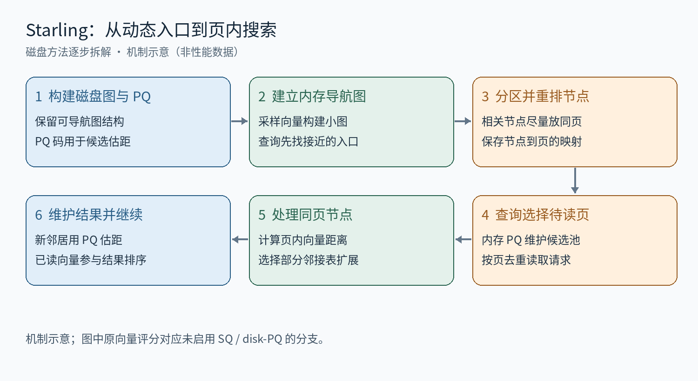
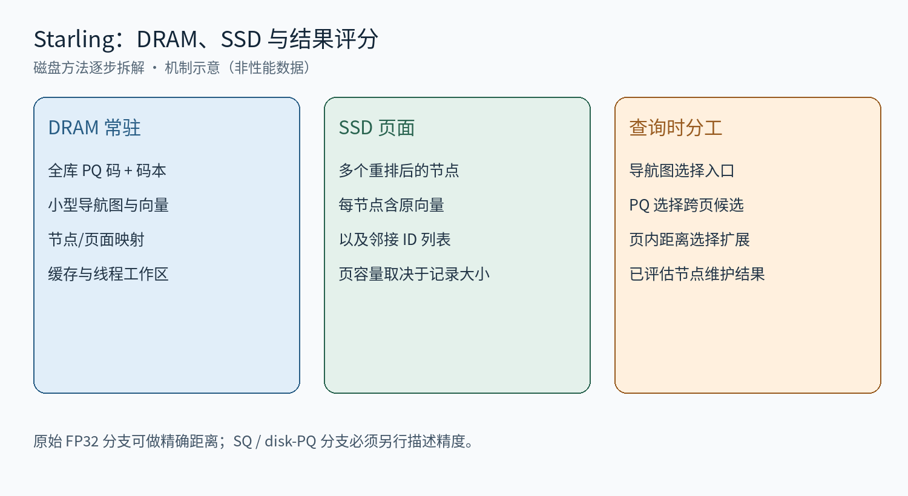

# Starling 逐步拆解：内存导航图、块重排与页内搜索

面向已了解向量距离、PQ 和图近邻搜索的研究人员。沿用本系列模板：第一部分先讲原方法的全流程、符号、分步机制、存储查询与误差边界；第二部分说明本地接入和验证状态。公式以 L2 为例。核对日期：2026-09-17；本文没有运行新的性能实验。

## 论文原方法与固定官方实现

### 先看全流程与符号

Starling 解决的是磁盘图搜索中的两个问题：从固定入口走到相关区域需要多次读盘；读入一页却只使用其中一个节点，浪费带宽。它保留磁盘图的拓扑，通过内存导航图选入口、重排节点的物理位置、扩大页内有效处理范围来改善 I/O 效率。主线仍使用 PQ 为新邻居提供近似距离。

论文面向向量数据库的数据 segment；一个 segment 有独立的资源预算。不能把论文中的预算场景解释为命令行自带全进程内存硬限制。下面的参数、记录长度与具体执行细节以固定官方代码为准，不将所有工程开关都归为论文新增贡献。

原方法来源：[Starling，SIGMOD 2024，数据布局与块搜索](https://arxiv.org/abs/2401.02116)

| 符号 | 类型与含义 |
| --- | --- |
| N，D；x，q | 数据库大小、原维数；数据库向量与查询向量 |
| G，R；P，C | 磁盘图、最大出度；页字节数、每页可容纳节点数 |
| π(v)，B | 节点 v 所在页；一个节点分区/物理块 |
| p，Gnav，Lnav | 导航采样比例、导航图、导航搜索宽度 |
| m，K；Tj(a) | PQ 子空间数、每子空间中心数；查询距离表 |
| L，W，ρ | 磁盘候选池宽度、读取 beam、同页额外节点扩展比例 |

### 步骤 1：构建磁盘图与 PQ 编码

输入是数据库向量、距离度量和图度数预算。官方基于 DiskANN 的构建路径生成磁盘图，再训练分块 PQ。对每个子空间，数据库向量只保存最近中心的编号；256 个中心对应每子码一字节。图决定可到达路径，PQ 决定搜索时优先读谁，两者不能互相替代。

$$
k_j(x)=\arg\min_{0\le a<K}\|x^{(j)}-c_{j,a}\|_2^2,\qquad b_{\rm PQ}=m\quad(K=256).
$$

公式省略实现中的共享中心平移记号。若启用平移，数据库编码与 query 查表必须使用同一变换。本文不把 PQ 写成每个原维度固定几 bit 的标量量化。

代码定位：[磁盘构建与 PQ 预算](https://github.com/zilliztech/starling/blob/17dc3e8a011533a62374445f53963e951b72883a/src/aux_utils.cpp)

### 步骤 2：图分区与物理重排

输入是图和单页容量，输出是节点分区与节点到页的映射。固定官方分区器先初始化分区，再执行容量受限的 LDG 迭代。它统计一个节点的出邻居及入邻居已落入哪些分区，在连接数量与分区剩余容量之间折中。重排改变物理存储，不等于重新训练图或把边改成分区内边。

$$
s(v,B)=a(v,B)\left(1-\frac{|B|}{C}\right),\qquad |B|<C.
$$

这里 a(v,B) 表示代码中按出边和入边累计的邻接计数；互为邻居的关系可能分别计数。选择得分较高且未满的分区；若没有合适分区，则选仍有空位的分区。这是当前 LDG 实现的解释式，不是全局最优保证，也不能代表论文讨论的全部布局算法。

教学例子：如果 v 的三个邻接关系落在页 A、一个落在页 B，且两页剩余空间相近，将 v 放入 A 更可能让一次读取带回有用节点。但实际 query 未必沿这些边走，因此分区连通性高不保证每个 query 都省 I/O。

代码定位：[select_partition 与 graph_partition_LDG](https://github.com/SonglinLife/SSD_BASED_PLAN/blob/ee8c04d/include/partitioner.h)

### 步骤 3：建立内存导航图并选择入口

从数据库采样一小部分向量，另建驻留内存的导航图。query 先在这个小图中搜索，把返回的原数据库 ID 作为磁盘搜索入口。它不是缓存若干磁盘节点那么简单：导航图有自己的向量、边和搜索工作区。官方提供均匀采样和基于访问频率的选点；频率应来自训练或验证查询，不应使用最终测试查询调参。

$$
N_{\rm nav}\approx pN,\qquad M_{\rm nav,main}\approx pN(4D+4R_{\rm nav})\quad(\mathrm{FP32}).
$$

上述只估算向量和边的主要字节，未包含向量对齐、ID、容器容量与线程工作区。采样率控制图规模，mem_L 控制导航搜索宽度；mem_L=0 时当前搜索程序不加载导航图。二者都不是以 GiB 为单位的总内存上限。

代码定位：[导航图采样、构建和搜索开关](https://github.com/zilliztech/starling/blob/17dc3e8a011533a62374445f53963e951b72883a/scripts/run_benchmark.sh)

### 步骤 4：索引真正存下什么

| 位置 | 对象 | 作用 |
| --- | --- | --- |
| DRAM | 全库 PQ 码与共享码本 | 发现新邻居后，无需为了取 PQ 再读目标节点 |
| DRAM | 导航图向量、边、ID | 为 query 选择动态入口 |
| DRAM | id2page 与页内 ID 列表 | 将逻辑节点映射到物理页并解释页内容 |
| DRAM | 可选节点缓存、全部线程工作区 | 缓存复用、候选维护、I/O 缓冲 |
| SSD | 重排后的向量与邻接表记录 | 一次读取可处理同页多个节点 |

$$
S_{\rm node}=D\,\mathrm{sizeof}(T)+4(R+1),\qquad C=\left\lfloor\frac{4096}{S_{\rm node}}\right\rfloor.
$$

这是当前普通磁盘构建路径的记录容量公式。R=64、FP32 时，D=960、1024、1536 对应 4100、4356、6404 字节，均超过一页。该路径后续使用 C 做计算，不能假设自动支持跨页节点。官方存在 SQ 功能不等于当前脚本的初始 FP32 建图路径已经绕开这个限制。

### 步骤 5：query 查表、选择页面与页内扩展

$$
T_j(a)=\|q^{(j)}-c_{j,a}\|_2^2,\qquad \widehat d^2(q,x)=\sum_{j=1}^{m}T_j(k_j(x)).
$$

query 准备 PQ 距离表后，用导航入口初始化候选池。选择尚未访问页面中的优质候选，按页去重并发出请求。读入页后先处理触发这次读取的节点，计算其原始向量距离并展开邻接表；新邻居继续用内存 PQ 码估距。

同页其他节点也会计算向量距离并参与结果维护。当前 page_search 代码按距离排序这些额外节点，只展开其中一定数量的邻接表。若页有 s 个节点，额外扩展数量为 floor(ρ(s−1))，触发节点单独处理。ρ 控制的是额外邻接表扩展数量，不是只读取页面的一部分。

$$
n_{\rm extra}=\lfloor\rho(s-1)\rfloor,\qquad d^2(q,x)=\sum_{i=1}^{D}(q_i-x_i)^2.
$$

例如 s=5、ρ=0.5，读入的仍是整页：处理触发节点，给另外四个节点评分，并额外展开其中两个的邻接表。页内距离在 FP32 分支是原向量距离；启用 SQ 时不能沿用“原始 FP32 exact”的表述。

代码定位：[page_search：页面去重、页内评分和 use_ratio](https://github.com/zilliztech/starling/blob/17dc3e8a011533a62374445f53963e951b72883a/src/page_search.cpp)

### 步骤 6：把页内计算与下一轮 I/O 重叠

固定代码先提交本轮页面读取，再处理上一轮已读页面中的剩余节点，并处理缓存命中；之后等待本轮读取完成，优先处理本轮触发节点，把余下页内工作留到下一轮。这样上一轮的计算可覆盖一部分下一轮 I/O 等待。W 是单查询的读取 beam，T 是并发查询线程数，二者不能混用。

最终在已评估节点中选 top-k。读取原向量时即可维护精确结果，不要求另设统一的搜索后精排阶段；若配置使用压缩磁盘向量或独立 reorder 数据，必须按相应分支说明。

### 内存预算和误差边界

$$
M_{\rm total}=Nm+M_{\rm codebook}+M_{\rm nav}+M_{\rm mapping}+M_{\rm cache}+T M_{\rm scratch}+M_{\rm other}.
$$

| 参数 | 实际含义 | 不能据此声称 |
| --- | --- | --- |
| -B / search_DRAM_budget | 构建时按预算推导 PQ 字节数，带预留与码长截断 | 整个搜索进程被硬限制在 B GiB |
| MEM_RAND_SAMPLING_RATE / MEM_R | 导航图样本比例 / 图度数 | 导航图只占样本原向量文件大小 |
| mem_L | 导航图搜索宽度；0 关闭导航图 | 以 MB 或 GiB 配置导航内存 |
| num_nodes_to_cache | 缓存节点数量 | 0 表示没有任何内存索引 |
| -T、-L、-W | 线程数、候选池宽度、读取 beam | 只影响速度、不增加工作区 |

PQ 误差会改变跨页优先级；页内扩展比例会改变后续访问集合。已读节点的精确评分只能修正这些节点间的排序，不能找回未访问的近邻。更多页内扩展也可能增加候选与计算，因此页面利用率、读取字节、延迟与 recall 应共同评价。

参数依据：[搜索命令行](https://github.com/zilliztech/starling/blob/17dc3e8a011533a62374445f53963e951b72883a/tests/search_disk_index.cpp)

## 我们的磁盘接入、验证状态与执行顺序

本地固定 Starling 提交 17dc3e8a011533a62374445f53963e951b72883a，并记录图分区子模块版本。采用官方 CLI；Python 外层只转换数据、组织命令、保存日志与哈希，不移植 page_search，也不以 ours 的图或量化器替换原方法。

| 环节 | 当前接入 |
| --- | --- |
| 数据 | fvecs 无损转换为官方 float bin，保留维度、值与 ID |
| 构建 | 官方磁盘图/PQ → 随机采样 → 内存导航图 → partitioner → index_relayout |
| 查询 | 官方 search_disk_index；use_page_search=1、mem_L 非零、use_sq=0 |
| 内存 | PQ、导航图、映射、缓存、全部线程工作区均需计入总预算 |
| 验证 | 已完成 1024 条、64 维和 16 条 query 的小规模功能验证 |
| 待验收 | 三套目标高维数据兼容性、统一资源限制、计时口径和正式性能曲线 |

本地接入记录显示，L=10/40 的小样本结果 ID 合法、top-10 无重复，返回距离通过原向量 L2² 重算检查。这是功能检查，不是目标规模的性能或公平性验收。新四方法方案要求独立验证集调参、匹配 Recall@10、32 workers、至少三次正式测量；本篇不新增性能数字。

运行入口为 experiments/05_disk_system_fair/run_official_disk_baseline.py，默认只打印命令计划，显式 execute 才执行。基础独立 runner 尚未完成统一预算验收；另有 2026-09-17 的 GIST 外层恢复驱动加入内存下界预检。RLIMIT_AS=2 GiB 协议属于地址空间受限实验，不能改称 2 GiB DRAM 实验。

2026-09-17 更新：已有 GIST R48 官方索引，不能再把全部目标高维数据概括为仅完成 64 维 smoke test。固定版本给每线程分配 4×16384×aligned_dim 字节坐标工作区；GIST 960 维为每线程 60 MiB，32 线程共 1920 MiB。加上其余已知对象，预检下界已超过 2 GiB，且仍未含全部开销。原生 32 线程／2 GiB 初始化失败已定位到分配失败后的空指针清零。相同索引和二进制在 32 线程／4 GiB、16 线程／2 GiB 的 16 查询诊断中完成，结果一致。4 GiB 恢复运行是独立诊断，不能并入原 2 GiB 主对比；全量运行状态以原结果目录为准。本篇只引用已有证据，没有启动或重跑实验。

新增本地证据：docs/analysis/starling_memory_recovery_20260917/README.md、memory_preflight.json、validation.json。

教学复习：导航图减少起步阶段的搜索距离；图分区改善一页中节点的相关性；页搜索真正使用这些节点；PQ 仍负责新邻居的廉价估距。四者各自承担不同任务。

本地协议：docs/plans/DISK_BASELINE_FAIR_COMPARISON_20260916.md；docs/plans/OFFICIAL_DISK_BASELINES.md

固定代码：[Starling 官方版本](https://github.com/zilliztech/starling/tree/17dc3e8a011533a62374445f53963e951b72883a)
