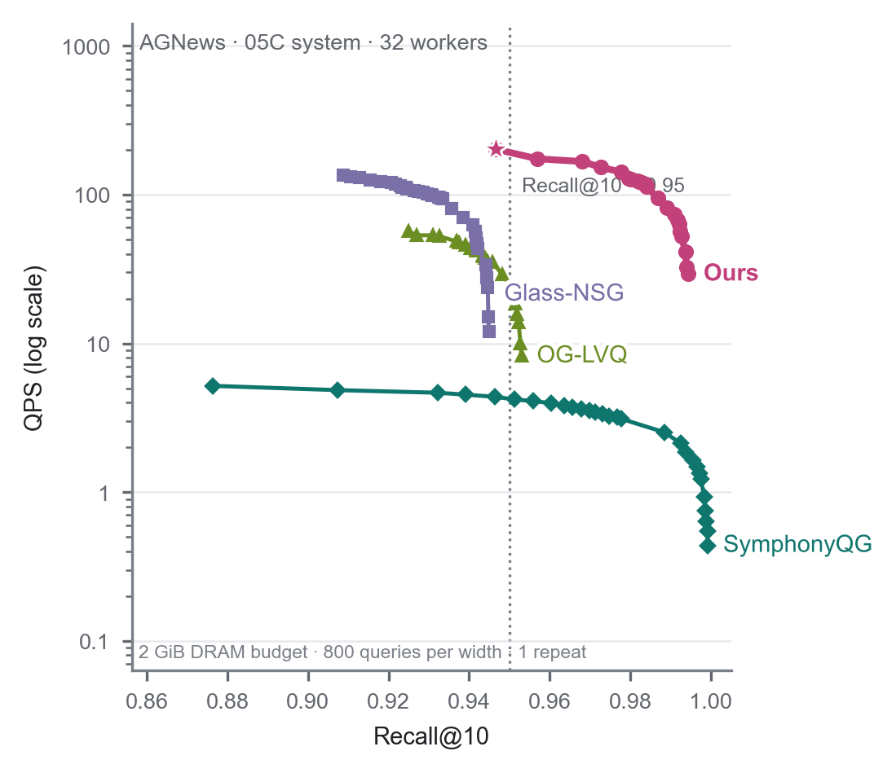
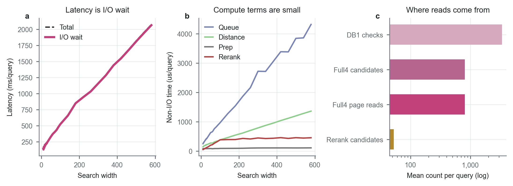

# AGNews 磁盘环境 32 线程实验分析

本文件使用普通 Markdown 图片链接，适合 IDE/GitHub 预览；飞书导入版见 `docs/analysis/disk_w32_agnews_analysis_report_feishu.md`。

数据来源：AGNews 05C 四个方法。Ours-Disk、OG-LVQ、Glass-NSG 使用本机新 run `agnews_05c_rerun_20260901_152210` 的 w32 sweep；SymphonyQG 使用 `fix_w32_diskpayload_symphony_20260831_140957` 修正后的完整 sweep。

## 构建

02 graph build 是共享的：DiskANN 家族（PQ-DiskANN / SQ-DiskANN / SAQ-DiskANN）共用同一张 fp32 Vamana shared graph，本机重跑一次，graph meta 记录总构建时间约 40.32 min、distance evaluations 约 40094397151、graph bytes 约 213.90 MiB。Ours 使用独立的 ours_native 图。没有保留 progress-stage 分段日志（GIST 的 02build 日志同样只有最终汇总格式），所以不能拆 train/encode/graph build 三段。

### 构建成本（总 = 构图 + 磁盘索引导出）

| 方法 | 构图耗时 (min) | 磁盘索引导出 (min) | 总构建成本 (min) | 构图 peak RSS (GiB) | 导出 peak RSS (GiB) | 来源 |
|---|---:|---:|---:|---:|---:|---|
| Shared fp32 Vamana（PQ/SQ/SAQ 共用） | 40.32 | — | 40.32（共享一次） | — | — | shared_graph meta |
| PQ-DiskANN | 40.32（共享） | 14.87 | 55.19 | — | 8.15 | shared meta + export build_stats |
| SQ-DiskANN | 40.32（共享） | 0.36 | 40.68 | — | 3.75 | shared meta + export build_stats |
| SAQ-DiskANN | 40.32（共享） | 5.44 | 45.77 | — | 3.75 | shared meta + export build_stats |
| Ours（native） | 2.46 | 6.67 | 9.13 | 6.80 | 3.89 | Ours_OursDiskANN_M64_build.json + export build_stats |
| OG-LVQ | 3.59 | 0.07 | 3.66 | 3.34 | 3.36 | OG-LVQ_LVQ4_R64_W400_build.json + export build_stats |
| Glass-NSG | 2.82 | 0.62 | 3.44 | 8.36 | 5.71 | Glass-NSG_R64_L400_build.json + export build_stats |
| SymphonyQG | 3.07 | 27.88 | 30.95 | 14.77 | 26.63 | SymphonyQG_R64_EF400_t3_build.json + export build_stats |

统一口径：本表“构图耗时”一律取 **from-scratch 官方 build record**（`*_build.json` 的 `build_time_ms`；Ours 取 total 2.46 min），`graph_build_mode=reused_graph` 的记录不计入构图耗时；“磁盘索引导出”为 05 层 export 的 `.build_stats.json`（payload 编码 + 写盘，wall 耗时与 peak RSS）。

Ours 磁盘查询使用的 native 图在 02 raw 中的拆分为 graph build 6.77 s / encode 17.47 s / total 24.25 s，其 `graph_build_mode=reused_graph`，属于复用图加载 + payload 编码，不是 from-scratch 构建；官方从零构建记录为 `Ours_OursDiskANN_M64_build.json`（graph 2.34 min / total 2.46 min / peak 6.80 GiB）。两者是两套口径（reused 加载 vs from-scratch 构建），不直接比较。M64 官方记录未记录 Lbuild/alpha；磁盘查询图参数（R64/Lbuild400/alpha1.2、ExRaBitQ4-symmetric）来自 02 manifest。

构建成本分析：总成本排序为 PQ（55.19）> SAQ（45.77）> SQ（40.68）> SymphonyQG（30.95）> Ours（9.13）> OG-LVQ（3.66）> Glass-NSG（3.44）min。PQ/SQ/SAQ 的总成本被共享图构建（40.32 min，仅发生一次）主导，其边际导出成本只有 14.87 / 0.36 / 5.44 min（差异来自 payload 编码方式：PQ 训 codebook、SAQ 球面变换、SQ 纯标量）。SymphonyQG 总成本几乎全在磁盘索引导出（约 90%），是第三方系统里导出最重的；Ours 构图轻（2.46 min）且导出 6.67 min，总 9.13 min，显著低于 SymphonyQG 与“按全额共享图口径”的 DiskANN 家族；OG-LVQ / Glass-NSG 最轻（<4 min）。

### Ours 索引大小（4bit / 8bit）

| 组成 | 大小 |
|---|---:|
| 4-bit payload | 407 MB |
| 8-bit payload（4-bit + residual） | 906 MB |
| adjacency | 263 MB |
| fp32 base（单独存放） | 0 |
| 4-bit 索引（4-bit payload + adjacency） | 638.6 MiB |
| 8-bit 索引（8-bit payload + adjacency） | 1114.1 MiB |

## 查询

### Ours 查询参数与口径

| 项 | 值 |
|---|---|
| 数据集 | agnews（769k × 1024） |
| 存储 | 4-bit payload 407 MB + 8-bit payload（4bit+residual）906 MB + adjacency 263 MB；fp32 base 单独存放 |
| 查询 | 32 workers、2 GiB budget、hybrid_disk、direct I/O + native AIO、page 4096 |
| sweep | width 10–580（40 点）、beam=1、ablation=db1+coalescing+reuse |
| parity | passed |

### 05C 方法指标对比

| 指标 | Ours-Disk | OG-LVQ | Glass-NSG | SymphonyQG |
|---|---:|---:|---:|---:|
| Recall@10 范围 | 0.9317 - 0.9944 | 0.9189 - 0.9530 | 0.9038 - 0.9449 | 0.8213 - 0.9992 |
| 最高 QPS | 202.13 | 56.72 | 135.55 | 5.18 |
| 平均 latency | 586.72 ms/query | 2609.75 ms/query | 686.04 ms/query | 29576.80 ms/query |
| I/O wait 占比 | 99.43% | 97.68% | 94.69% | 99.75% |
| distance compute 占比 | 0.08% | — | — | — |
| I/O requests/query | 931.4 | 3578.8 | 2846.8 | 3708.8 |
| bytes read/query | 3.64 MiB | 13.98 MiB | 11.12 MiB | 57.95 MiB |
| DB1 checks/query | 3362.3 | — | — | — |
| full4 page reads/query | 809.7 | — | — | — |

注意：OG-LVQ、Glass-NSG、SymphonyQG 没有暴露 DB1 / full4 内部计数，其 distance/queue 字段基本等于总耗时，无法与 Ours 的 distance compute 单独拆分口径对比，所以这些格标为“—”。

05C 指标分析：在 Recall@10 0.93–0.994 的论文工作区里，Ours-Disk 的 recall–QPS 前沿整体占优——最高 QPS 202.13、平均 latency 586.72 ms/query、I/O 请求 931.4 次与 3.64 MiB/query 均为四个方法里最低。四个方法都以 I/O wait 为主（≥94.7%），磁盘读取是共同瓶颈；Ours 的 distance compute 仅 0.08%，其瓶颈在 DB1 1bit 初筛后的 full4 页读取（809.7 页/query）。SymphonyQG 把 recall 上限推到 0.9992，但 QPS 只有 5.18（约 Ours 的 1/39）、每查询读 57.95 MiB（约 Ours 的 16×），高 recall 靠高 I/O 成本换取；OG-LVQ（QPS ≤56.7、recall ≤0.953）与 Glass-NSG（QPS ≤135.5、recall ≤0.945）位于中间带。

### Figure 2：05B shared graph Recall-QPS（02 层）

图读法：02 层共享图方法（PQ-DiskANN / SQ-DiskANN / SAQ-DiskANN / Ours-Disk）的 Recall@10–QPS。

### Figure 3：05C system Recall-QPS（03 层）

图读法：03 层完整磁盘系统（Ours / SymphonyQG / OG-LVQ / Glass-NSG）的 Recall@10–QPS，使用本机最新数据（log-y）。

### Figure 4：Ours-Disk 查询时间拆分

图读法：只看 Ours-Disk。左图是 total latency 与 I/O wait；中图是非 I/O 的 prep/queue/distance/rerank；右图是每 query 的 DB1/full4/rerank 平均计数。

### 查询差距与不同（重点）

- **Recall 上限**：Ours-Disk 最高，约 0.9944；SymphonyQG 约 0.9992；OG-LVQ 约 0.9530；Glass-NSG 约 0.9449。
- **Latency / QPS**：Ours-Disk 平均 latency 约 586.72 ms/query、最高 QPS 约 202.13，在四个方法里吞吐最高且延迟最低；SymphonyQG 平均 latency 约 29576.80 ms/query。
- **I/O 成本**：同 recall 下 Ours-Disk 的 I/O requests/query 和 bytes read/query 明显低于其他三个方法。平均来看 Ours-Disk 约 931.4 次/query、3.64 MiB；Glass-NSG 约 2846.8 次/query、11.12 MiB；OG-LVQ 约 3578.8 次/query、13.98 MiB；SymphonyQG 约 3708.8 次/query、57.95 MiB。
- **瓶颈**：四个方法都以 I/O wait 为主（Ours-Disk 99.43%、OG-LVQ 97.68%、Glass-NSG 94.69%、SymphonyQG 99.75%）。Ours-Disk 的 distance compute 只有 0.08%，说明 Ours 不是距离核慢，而是读盘等待慢。
- **Ours 为什么快**：Ours-Disk 的 DB1 1bit 初筛把 full4 候选压到约 811.1 个/query，只读 4bit 页面（3.64 MiB/query），且页面访问已顺序化（约 200–350 MB/s），所以吞吐远高于以随机读为主的 OG-LVQ / Glass-NSG / SymphonyQG。同时 Ours 索引只有 1.36 GB（SymphonyQG 约 12.6 GB），磁盘 footprint 也更小。

### Ours 进一步优化

按收益排序（数据：AGNews 05C、w32、2 GiB DRAM 预算）：

1. **把预算里空着的约 1 GiB 真正用去缓存 4-bit payload 页。**
   现状：内存里只有 1-bit 常驻码（0.95 GiB）+ 26 MB 邻接表缓存，约 0.98 GiB，2 GiB 预算还剩约 1 GiB 空着；而且那个 26 MB 缓存被写死成“最多缓存 10% 节点”，缓存的是邻接表、不是真正吃 IO 的 4-bit 数据，所以每查询约 810 次 full4 页读仍全落盘。做法：去掉 10% 上限，把剩余预算用来缓存高频 4-bit payload 页（4-bit 全量仅 0.38 GiB，1-bit + 4-bit 合计 1.33 GiB，仍远低于 2 GiB）。这是收益最大的一项。

2. **压低 full4 读量。**
   现在 DB1 1bit 初筛扫 3362 个候选、留下 810 个进 full4，随后几乎每个 full4 候选都要单独读一页（810 页/query）。可做：收紧 DB1 门控（让更少候选进 full4）、把同页候选合并成一次读、让 4bit 与 residual 落在同一页一次读回。

3. **提升页读取的顺序性与并发。**
   HDD 随机读慢（实测整盘约 62 MB/s，w32 已打满）。把要读的页按地址排序、加强 prefetch、加大 AIO depth，能让同样读字节下有效吞吐更高、查询更快。

4. **按目标 recall 选最小 width。**
   width 越大 recall 越高但读盘越多（width 10→580，延迟 144→2076 ms）。目标 recall 一定时，用刚好达标的 width，避免无谓读盘。

5. **热页 / 分层缓存。**
   对访问最频繁的 payload 页做长期驻留（热缓存），冷页仍从盘读，用足 2 GiB 预算但不超（只有把整张索引全塞内存才会到约 2.04 GiB）。

## 数据与口径

- 查询内存限制：`search_dram_budget_gib=2.0`；05C 均为 workers=32、repeat=0。
- Ours-Disk 为磁盘模式：`direct_io=True`、`native_aio=True`、`page_size=4096`。

## Source Data

- `results/disk_environment/03_system_fair/agnews/csv/formal_test_rows_formal_diskenv_20260826_114755_bc_agnews.csv`
- `results/disk_environment/03_system_fair/agnews/csv/formal_test_rows.csv`
- `results/disk_environment/.formal_runs/runs/fix_w32_diskpayload_symphony_20260831_140957/`
