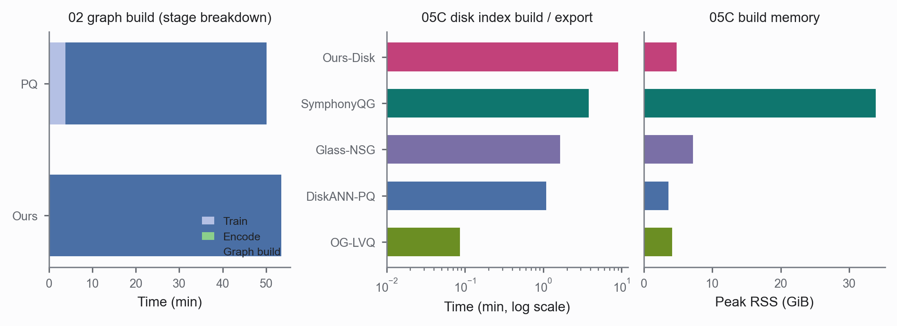
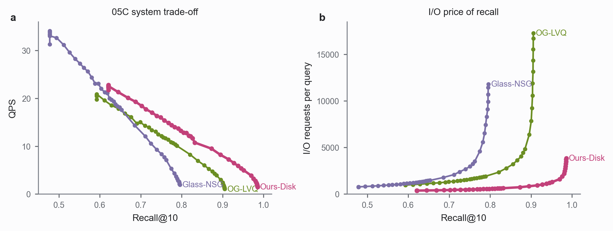
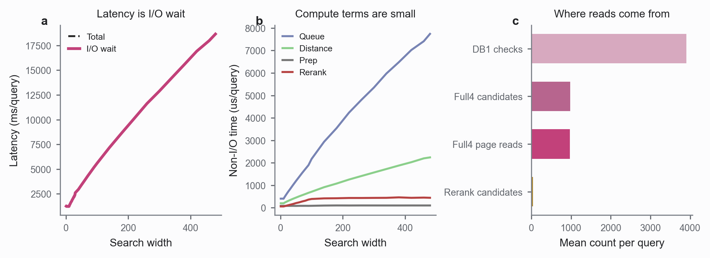

# GIST 磁盘环境 32 线程实验分析

本文件使用普通 Markdown 图片链接，适合 IDE/GitHub 预览；飞书导入版见 `docs/analysis/disk_w32_gist_analysis_report_feishu.md`。

数据来源：`docs/notes/test.md` 指定的 `gist_test_20260829_204245`，读取 `round_w32/05a_rows.csv`、`round_w32/05b_rows.csv`、`round_w32/05c_rows.csv` 和对应 export/build artifact。本报告按「构建 / 查询」两部分组织；查询对比统一使用 05C system 层方法：Ours-Disk、OG-LVQ、Glass-NSG，另附 SymphonyQG 的 formal 单点参考。05B Ours-Disk 与 05C Ours-Disk 是同实现、同图，只作为 sanity record，不作为独立 Ours 变体。

## 构建

构建侧由两个阶段组成：02 graph build（图构建，最重）和 05C 磁盘索引构建/导出（把图转成磁盘索引）。

### Ours 构建步骤与峰值内存

| 阶段 | 耗时 | 说明 |
|---|---:|---|
| Train quantizer | 0.06 s | 极小，Ours 几乎不花在 quantizer train |
| Payload encode | 8.53 s | 把原始向量编码成 4-bit/8-bit payload |
| Graph build | 53.37 min | 3202.0 s，构建耗时的主体 |
| 02 graph build 合计 | 53.51 min | 3210.5 s |
| 05C 磁盘索引导出 | 9.00 min | 539.8 s |
| 05C 导出 peak RSS | 4.82 GiB | 导出阶段最大常驻内存 |
| 磁盘索引大小 | 1768.76 MB | 不含 fp32 base |
| payload 分布 | 4-bit 529 MB / 8-bit 1177 MB / adjacency 341 MB / fp32 base 0 | — |

### 构建耗时精细化

- 02 graph build 只有 Ours 和 PQ 留下了分阶段日志（train / encode / graph build），所以单独拆开做 stage 分解；其他系统没有在同一 run 里留下可比的 02 build stage 日志。这就是为什么 Figure 1 左图只出现 Ours 和 PQ，不是要把它们与其他系统隔离。
- Ours 的 02 graph build 总耗时约 53.51 min，其中 graph build 约 53.37 min；PQ 总耗时约 50.15 min，其中 train 约 3.75 min、graph build 约 46.40 min。

### 05C 磁盘索引构建/导出对比

| 方法 | 磁盘索引构建/导出 (min) | 构建 peak RSS (GiB) | read (MB) |
|---|---:|---:|---:|
| Ours-Disk | 9.00 | 4.82 | 0.00 |
| OG-LVQ | 0.09 | 4.13 | 0.00 |
| Glass-NSG | 1.64 | 7.18 | 0.00 |
| SymphonyQG | 3.82 | 33.90 | 0.00 |
| DiskANN-PQ | 1.09 | 3.62 | 229.04 |

### Figure 1：构建耗时精细化

图读法：左图是 02 graph build 的分阶段耗时；中图是 05C 磁盘索引构建/导出耗时（log scale）；右图是构建 peak RSS。图中不再标注 a/b/c，Ours 只保留 05C 版本（Ours-Disk），不重复出现 05B Ours-Disk。

构建差距与不同：

- **02 graph build**：Ours 约 53.51 min，几乎全部花在 graph build（约 53.37 min）；PQ 约 50.15 min，其中约 3.75 min 花在 quantizer train。即 Ours 构图阶段比 PQ 更重，而 PQ 多出一段 train 成本。
- **磁盘索引构建/导出**：Ours-Disk 约 9.00 min，明显慢于 OG-LVQ（约 0.09 min）、DiskANN-PQ（约 1.09 min）、Glass-NSG（约 1.64 min）、SymphonyQG（约 3.82 min）。Ours 从图转磁盘索引的导出阶段是五个方法里最慢的。
- **构建内存**：SymphonyQG 的 peak RSS 最高，约 33.90 GiB；Ours-Disk 约 4.82 GiB；DiskANN-PQ 最低约 3.62 GiB。

## 查询

### Ours 查询参数与口径

| 参数 | 值 |
|---|---|
| dataset / base_count / dimension | gist / 1,000,000 / 960 |
| workers | 32 |
| search_dram_budget_gib | 2.0 |
| storage_mode / cache_mode | hybrid_disk / standard |
| kernel | ExRaBitQ4 symmetric Vamana + DB1 x INT8 production search |
| direct_io / native_aio / io_backend | True / True / linux_native_aio_odirect |
| page_size | 4096 |
| whole_graph_in_memory / whole_payload_in_memory | False / False |
| search_width sweep | 1 到 480（47 个点），beam_width=1 |
| ablation | db1+coalescing+reuse |
| query_count / warmup_queries | 800 / 100 |
| index_size_mb | 1768.76 |
| resident / peak RSS | 1.23 GiB / 1.19 GiB |

### 05C 方法指标对比

| 指标 | Ours-Disk | OG-LVQ | Glass-NSG | SymphonyQG |
|---|---:|---:|---:|---:|
| Recall@10 范围 | 0.6209 - 0.9858 | 0.5926 - 0.9054 | 0.4779 - 0.7957 | 0.9346（单点） |
| 最高 QPS | 22.78 | 20.88 | 34.10 | 13.20 |
| 平均 latency | 4559.44 ms/query | 6616.28 ms/query | 3624.63 ms/query | 62.91 ms/query |
| I/O wait 占比 | 99.91% | 99.18% | 99.29% | 94.75% |
| distance compute 占比 | 0.01% | — | — | — |
| I/O requests/query | 1046.2 | 3982.1 | 2863.9 | 104.6 |
| bytes read/query | 4.09 MiB | 15.56 MiB | 11.19 MiB | 1.63 MiB |
| DB1 checks/query | 3906.7 | — | — | — |
| full4 page reads/query | 965.6 | — | — | — |

注意：GIST 本次 run（`gist_test_20260829_204245`）只完成了 SymphonyQG 的 export/validate，没有 w32 test sweep；本地 formal CSV 里只有一条 ef=100 记录，所以 Recall 只写单点。OG-LVQ、Glass-NSG、SymphonyQG 没有暴露 DB1 / full4 内部计数，其 distance/queue 字段也基本等于总耗时，无法与 Ours 的 distance compute 单独拆分口径对比，所以这些格标为“—”。

### Figure 2：Recall/QPS/I-O 曲线

图读法：只看 05C system 层。左图是 Recall@10 与 QPS 的 trade-off；右图是达到相同 recall 时需要付出的 I/O requests/query。

### Figure 3：Ours-Disk 查询时间拆分

图读法：只看 05C Ours-Disk。左图对比 total latency 和 I/O wait；中图把 query prep、queue、distance、rerank 放大到微秒尺度；右图给出每 query 的 DB1/full4/rerank 平均计数。

### 查询差距与不同（重点）

- **Recall 上限**：Ours-Disk 最高，约 0.9858；SymphonyQG 单点约 0.9346；OG-LVQ 约 0.9054；Glass-NSG 约 0.7957。
- **Latency / QPS**：SymphonyQG 单点平均 latency 约 62.91 ms/query、QPS 约 13.20，明显快于 Ours-Disk；但它是 formal run 的单点，不是本次 sweep 的完整曲线，不能直接等同。Glass-NSG 的最高 QPS 约 34.10 看似最高，但只出现在低 recall 区间；Ours-Disk 最高 QPS 约 22.78。
- **I/O 成本**：同 recall 下 Ours-Disk 的 I/O requests/query 和 bytes read/query 都低于 OG-LVQ 与 Glass-NSG。平均来看 Ours-Disk 约 1046.2 次/query、4.09 MiB；Glass-NSG 约 2863.9 次/query、11.19 MiB；OG-LVQ 约 3982.1 次/query、15.56 MiB。SymphonyQG 单点更低，约 104.6 次/query、1.63 MiB。
- **瓶颈**：Ours-Disk、OG-LVQ、Glass-NSG 都以 I/O wait 为主（Ours-Disk 99.91%、OG-LVQ 99.18%、Glass-NSG 99.29%）。Ours-Disk 的 distance compute 只有 0.01%，说明 Ours 不是距离核慢，而是随机读盘等待慢；优化应优先减少 full4 page read、改善 page packing/coalescing/prefetch/AIO depth。

## 数据与口径

- 查询内存限制：`search_dram_budget_gib=2.0`；当前 GIST w32 只有 repeat=0，结论适合定位瓶颈，不适合直接作为最终论文误差条。
- Ours-Disk 为磁盘模式：`whole_payload_in_memory=False`、`direct_io=True`、`native_aio=True`、`page_size=4096`。

## Source Data

- `docs/analysis/source_query_rows_w32_gist.csv`
- `docs/analysis/source_build_export_stats_w32_gist.csv`
- `docs/analysis/source_02_graph_build_stats_gist.csv`
- `docs/analysis/table_best_rows_w32_gist.csv`
- `docs/analysis/table_ours_query_breakdown_w32_gist.csv`
- `docs/analysis/table_ours_experiment_audit_w32_gist.csv`
